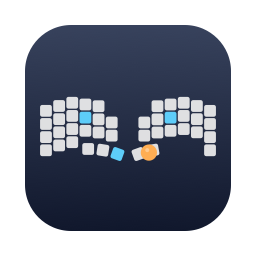

# roba-hud



roBa（ZMK 分割キーボード・右手トラックボール）専用の macOS フローティング HUD。

- **キーマップ表示** — `zmk-config-roBa` の `config/roBa.keymap` / `config/roBa.json` を直接パースし、実配置（親指キーの回転含む）でレイヤー別に描画。常に最前面・全 Spaces / フルスクリーン上でも表示
- **リアルタイム打鍵ハイライト** — IOHIDManager で roBa デバイスの生 HID だけを購読（他のキーボードは無視）。修飾ホールド（mt）、マウスボタン、かな/英数もハイライト
- **レイヤー自動推定** — レイヤーは HID に乗らないため、キーコード逆引き＋トラックボール検知（移動=MOUSE / スクロール=SCROLL、ファームの 700ms automouse と同じ減衰）で表示レイヤーを推定。レイヤーピルで手動ピン留めも可能
- **打鍵ヒートマップ / 統計** — キー・レイヤー別の使用頻度をローカル記録し、キーマップに重ねて表示
- **キーマップ編集** — 編集モードでキーをクリック → キーコード選択 → `.keymap` を外科的に書き換え（列揃え維持・書込前に再パース検証）→ diff 確認 → Commit & Push → GitHub Actions のビルドを監視 → UF2 を自動ダウンロード → 書き込みガイド表示。**リポジトリが正本のまま**
- **左右バッテリー監視**（zmk-battery-center 相当） — CoreBluetooth で標準 Battery Service (0x180F) を購読し、CUD "Peripheral N"（ZMK の `CONFIG_ZMK_SPLIT_BLE_CENTRAL_BATTERY_LEVEL_PROXY`）で左右を識別。ヘッダーに右/左の残量チップ、クリックで履歴グラフ（24h/7日/30日・Swift Charts）。低残量通知（しきい値可変・ヒステリシス付き）・接続/切断通知・ログイン時自動起動（SMAppService）に対応。既存の HID ボンドに相乗りするため打鍵には影響しない

## セットアップ

```sh
# 1. 安定した署名アイデンティティを作成（初回のみ・重要）
./scripts/create-signing-cert.sh

# 2. ビルドして /Applications へ
./scripts/package-app.sh --install

# 3. 起動 → 「入力モニタリング」を許可 → アプリを再起動
open /Applications/RoBaHUD.app
```

### ⚠️ Input Monitoring（TCC）の注意

- 権限は**コード署名アイデンティティ単位**で付与される。ad-hoc 署名のままだとビルドごとに権限が剥がれ、無言で打鍵が取れなくなる → 必ず手順 1 を先に実行
- `swift run` での実行は TCC がターミナル側に帰属するため、打鍵キャプチャの確認は**パッケージ済み .app** で行うこと

## CLI

```sh
swift run RoBaHUD --selftest      # 依存ゼロの自己テスト（CI と同一）
swift run RoBaHUD --parse-check   # 実 keymap のパース検証
/Applications/RoBaHUD.app/Contents/MacOS/RoBaHUD --hid-dump       # HID イベントを標準出力へ
/Applications/RoBaHUD.app/Contents/MacOS/RoBaHUD --battery-dump   # 左右バッテリー読み取りの診断
```

## 設定

`defaults write com.tktk7l9.roba-hud <key> <value>`

| key | 既定値 | 説明 |
|---|---|---|
| `zmkConfigPath` | `~/src/github.com/tktk7l9/zmk-config-roBa` | zmk-config リポジトリの場所 |
| `opacity` | `0.95` | パネルの不透明度（ギアメニューからも変更可） |

## 仕組みメモ

- roBa は BLE 上で単一の IOHIDDevice（VID 0x1D50 / PID 0x615E は ZMK 既定値のため Product 文字列 "roBa" で識別）。左手側のキーも右手側（セントラル）経由で届く
- キーボードは NKRO ビットマップ（usage ごとの variable 要素）。consumer ページは variable / array 両様式に対応
- `&mo` / `&to` / lt・mt のホールドは HID を発しない → 表示は「証拠追随」。`&trans` は解決先（BASE）で逆引き登録
